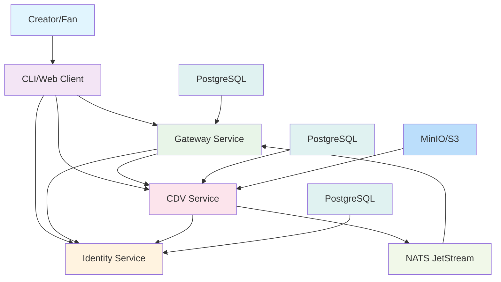

# Architecture

This document provides an overview of the RegistryAccord system architecture, explaining how the different components interact to provide a complete decentralized creator platform.

## System Overview

RegistryAccord is built on a microservices architecture with several specialized services that work together to provide a complete platform for creators:

## Core Services

### Identity Service

The Identity Service is responsible for:

- Creating and managing Decentralized Identifiers (DIDs)
- Handling authentication through JWT session tokens
- Publishing public keys via JWKS for verification
- Managing key rotation with overlapping validity windows
- Providing identity recovery mechanisms

### Creator Data Vault (CDV)

The CDV service provides secure storage for creator content:

- Schema-enforced record storage
- Media upload and management
- JWT-based authorization
- Event streaming via NATS JetStream
- S3-compatible storage backend

### Gateway Service

The Gateway service offers read-side APIs:

- Feed generation (following and author feeds)
- Search functionality
- Profile lookups
- Payment stubs for Phase 1
- JWT verification using Identity service JWKS

## Data Flow

1. **Identity Creation**: Creators generate a DID through the Identity service
2. **Authentication**: Sessions are established via nonce challenge
3. **Content Creation**: Creators publish content to the CDV service
4. **Event Processing**: CDV emits events that Gateway consumers process
5. **Content Discovery**: Fans discover content through Gateway APIs

## Event System

RegistryAccord uses NATS JetStream for event streaming:

- **Record Events**: Published when content is created/updated
- **Media Events**: Published when media uploads are finalized
- **Consumers**: Gateway service consumes events to maintain indexes

## Storage

Different services use specialized storage solutions:

- **PostgreSQL**: Structured data storage for Identity, CDV, and Gateway
- **S3/MinIO**: Object storage for media files
- **In-memory**: Development storage option for all services

## Security

RegistryAccord implements several security measures:

- JWT-based authentication with Ed25519 signatures
- JWKS for public key discovery
- Schema validation for all data
- Structured logging with correlation IDs
- CORS protection

## Observability

All services include:

- Health and readiness endpoints
- Prometheus metrics
- Structured JSON logging
- Correlation IDs for request tracing
