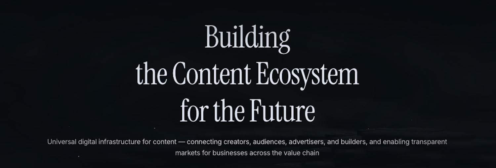

RegistryAccord Docs is now live, providing a single home for the open protocol that lets creators own their work, audience, and the economics of their business. <!-- [attached_file:1] -->

You can access the site at the public URL and follow the Getting Started path to run locally in minutes. <!-- [attached_file:1] -->

{/* truncate */}

## What is RegistryAccord

RegistryAccord is an open protocol built on decentralized identity and open standards to enable creator ownership and portability across platforms. <!-- [attached_file:1] -->

The project emphasizes interoperability and works across different services, with creators retaining control over content, audience, and data. <!-- [attached_file:1] -->

## What’s in this release

- A restructured documentation hub with About, Getting Started, Contributing, and technical guides to cover all core components. <!-- [attached_file:1] -->
- Automated GitHub Pages deployment so every merge to main publishes the latest docs for contributors. <!-- [attached_file:1] -->
- Updated styling and a blog section to share architecture deep dives, roadmaps, and contribution calls. <!-- [attached_file:1] -->

## Platform architecture at a glance

The platform centers on key services including an Identity layer, a Content Registry, a Storage Abstraction, a Gateway/Feed layer, Payments and Revenue services, and Analytics/Telemetry. <!-- [attached_file:1] -->

These components are designed as open, interoperable building blocks so teams can adopt incrementally and extend the ecosystem. <!-- [attached_file:1] -->

## Build your first flow

Start with the Quickstart to run the docs site locally, then progress to creating a developer identity and publishing a sample piece of content through the registry. <!-- [attached_file:1] -->

Use the SDKs and CLI to authenticate, register content, and retrieve it via the feed or gateway once you have the dev stack running. <!-- [attached_file:1] -->

## How to contribute

The repository welcomes issues and pull requests, with docs authored in Markdown/MDX and CI set up to validate and deploy changes automatically. <!-- [attached_file:1] -->

Begin by forking the repository, creating a feature branch, and opening a PR that links to an Issue and includes screenshots for any UI changes. <!-- [attached_file:1] -->

## What’s next

Upcoming posts will share detailed component deep dives, sample app walkthroughs, and the contribution roadmap so builders can pick up well‑scoped tasks. <!-- [attached_file:1] -->

If you’re interested in specifications, APIs, or SDKs, watch this space for references and examples aligned to the protocol services. <!-- [attached_file:1] -->
